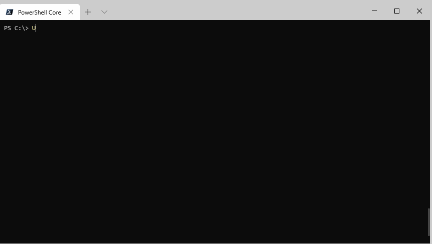
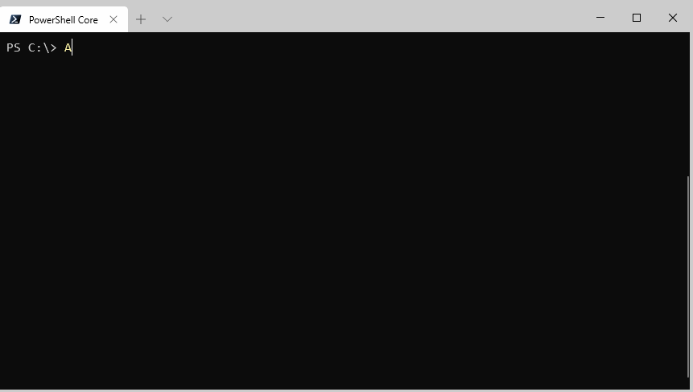
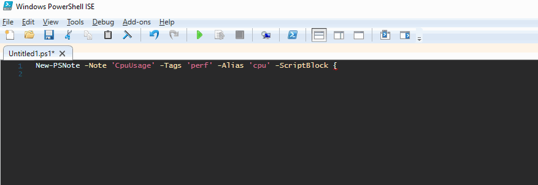

# PSNotes

PSNotes is a PowerShell module that allows you to create your own custom snippet library, that you can use to reference commands you run often. Or ones you don't run often and need a reminder on. Snippets can either be executed directly, copied to your clipboard, or simply output to the display for you to do whatever you want with them. When you create a note, you assign an alias to it, so you can have an easy to remember keyword that you can then use to recall it. Notes can also be classified with tags, so you can easily search for them. 

* [Key Features](#key-features)
* [Getting Started](#getting-started)
    * [Install Instructions](#install-instructions)
    * [Output and Run Notes](#output-and-Run-Notes)
    * [Search Notes](#search-notes)
    * [Creating Notes](#Creating-Notes)
    * [Updating Notes](#updating-notes)
    * [Sharing Notes](#sharing-notes)

# Key Features

### Recall a command using a specific alias keyword
When you create a new note, you can define an alias that you can later use to display or run it.


Perfect for long commands you need to run often.


### Easily search your notes
You can assign tags to your notes to make searching easier.


### Quickly add your own notes
Add new snippets at any time


Add new snippets as string or by using a script block


### Share your notes with others
The import and export functionality allows you to share notes between machines and people.


# Getting Started
## Install Instructions
PowerShell v5+ and PowerShell Core v6+
```powershell
Install-Module PSNotes
```

Note: At of the time of publishing Set-Clipboard is not supported in PowerShell Core. To use the copy to clipboard functionality of this module, it is recommended that you also install the ClipboardText module.


```powershell
Install-Module -Name ClipboardText
```
[top](#psnotes)
## Output and Run Notes
When you create a note in the PSNotes module you assign an alias to it. You can use this alias at any time to output, copy, or run a note. Simply type the name of the alias and hit enter to output it to your PowerShell console. You can also add the `-copy` switch to have the note copied to your clipboard or use the `-run` to execute the note directly.

###### Example 1: Output the note to the console
This example gets the note/code snippet with the alias "MyNote" and outputs it to the console.
```powershell
MyNote
```

###### Example 2: Output the note to the console
This example gets the note/code snippet with the alias "MyNote" and outputs it to the console and copies it to your local clipboard.
```powershell
MyNote -copy
```

###### Example 3: Execute the note directly
This example gets the note/code snippet with the alias "MyNote" and executes the command in your local session.
```powershell
MyNote -run
```
[top](#psnotes)
## Search Notes
Don't worry if you can't remember the alias you assigned to a note. You can use `Get-PSNote` to search your notes by name, tags, and keywords.

###### Example 1: Get all notes
This example gets all the notes currently loaded in your profile.
```powershell
Get-PSNote
```

###### Example 2: Get notes with a name that begins with string
This example gets all the notes that start with cred.
```powershell
Get-PSNote -Name 'cred*'
```

###### Example 3: Get notes with a name that contains a string
This example gets all the notes that have a name with the word "user" in it.
```powershell
Get-PSNote -Name '*user*'
```

###### Example 4: Get notes by tag
This example gets all the notes that have the tag "AD" assigned to them.
```powershell
Get-PSNote -Tag 'AD'
```

###### Example 4: Get notes that includes a search string
This example gets all the notes with the word "day" in the name, details, snippet text, alias, or tags.
```powershell
Get-PSNote -SearchString 'day'
```
[top](#psnotes)
## Creating Notes
You can create your own notes at any time using `New-PSNote`. Keep in mind that the snippet must be passed as string, so it is recommended to wrap them in single quotes and here-strings to prevent them from being executed when you are creating a note.

###### Example 1: Create a new note
This example creates a new note for the Get-ADUser cmdlet. Since the `-Alias` parameter is not supplied the Note value will be assigned as the alias.
```powershell
New-PSNote -Note 'ADUser' -Snippet 'Get-ADUser -Filter *' -Details "Use to return all AD users" -Tags 'AD','Users' 
```

###### Example 2: Create a new note with a custom alias
This example creates a new note with a custom alias.
```powershell
$Snippet = '(Get-Culture).DateTimeFormat.GetAbbreviatedDayName((Get-Date).DayOfWeek.value__)'
New-PSNote -Note 'DayOfWeek' -Snippet $Snippet -Details "Use to name of the day of the week" -Tags 'date' -Alias 'today'
```

###### Example 3: Create a new note using script block
This example creates a new note for the Get-WmiObject using a script block instead of a string. This make multiple line scripts easier to enter and gives you the ability to use auto-complete when entering it. 
```powershell
New-PSNote -Note 'CpuUsage' -Tags 'perf' -Alias 'cpu' -ScriptBlock {
    Get-WmiObject win32_processor | Measure-Object -property LoadPercentage -Average
}
```

###### Example 4: Create a new note with both single and double quotes in it
This example shows one way you can create a new note for a snippet that contains both single and double quotes. Notice in the snippet itself the single quotes are doubled. This escapes them and tells PowerShell it is not the end of the string. 
```powershell
New-PSNote -Note 'SvcAccounts' -Snippet 'Get-ADUser -Filter ''Name -like "*SvcAccount"''' -Details "Use to return all AD Service Accounts" -Tags 'AD','Users' 
```

###### Example 5: Create multiple line note
When creating a note for a multiple line snippet, it is recommended that you use a here-string with single quotes to prevent expressions from being evaluated when you run the `New-PSNote` command.
```powershell
$Snippet = @'
$stringBuilder = New-Object System.Text.StringBuilder
for ($i = 0; $i -lt 10; $i++){
    $stringBuilder.Append("Line $i`r`n") | Out-Null
}
$stringBuilder.ToString()
'@
New-PSNote -Note 'StringBuilder' -Snippet $Snippet -Details "Use StringBuilder to combine multiple strings" -Tags 'string'
```
[top](#psnotes)
## Updating Notes
You can update a note at any time using `Set-PSNote`. With `Set-PSNote` you can update the Snippet, Details, Tags, or Alias of any note. In addition, notes can be deleted using `Remove-PSNote`.

###### Example 1: Set new tags
This example shows how to add the tags "AD" and "User" to the note ADUser
```powershell
Set-PSNote -Note 'ADUser' -Tags 'AD','Users'
```

###### Example 2: Update Snippet
This example shows how to update the snippet for the note DayOfWeek
```powershell
$Snippet = '(Get-Culture).DateTimeFormat.GetAbbreviatedDayName((Get-Date).DayOfWeek.value__)'
Set-PSNote -Note 'DayOfWeek' -Snippet $Snippet
```

###### Example 3: Delete a note 
This example shows how to delete a note named creds. This command does not accept wildcards, so the name of the note must match exactly.
```powershell
Remove-PSNote -Note 'creds'
```
[top](#psnotes)
## Sharing Notes
Not only does PSNotes allow you to create your own custom notes. It allows you to share them between computers and users. You can create a list of notes export them and share them with your team. Notes are stored in easy to read and edit JSON files in case you want to make manual edits.

Note: PSNotes stores your notes in your local AppData folder using the path %appdata%\PSNotes. By default, it places them in the file PSNotes.json. When you run the `Import-PSNote` cmdlet you can choose a catalog name. Doing so will cause the imported notes to be stored in a file with that catalogs name. 

###### Example 1: Export all notes
This example exports all notes to a JSON file.
```powershell
Export-PSNote -All -Path C:\Export\MyPSNotes.json
```

###### Example 2: Export a selection of notes
This example exports the notes with the tag AD to a JSON file.
```powershell
Get-PSNote -tag 'AD' | Export-PSNote -Path C:\Export\SharedADNotes.json
```

###### Example 3: Import to personal store
This example imports the contents of the file MyPSNotes.json and saves it to your personal PSNotes.json file.
```powershell
Import-PSNote -Path C:\Import\MyPSNotes.json
```

###### Example 4: Import to custom catalog file
This example imports the contents of the file SharedADNotes.json and saves it to the file ADNotes.json in the folder %APPDATA%\PSNotes
```powershell
Import-PSNote -Path C:\Export\SharedADNotes.json -Catalog 'ADNotes'
```
[top](#psnotes)