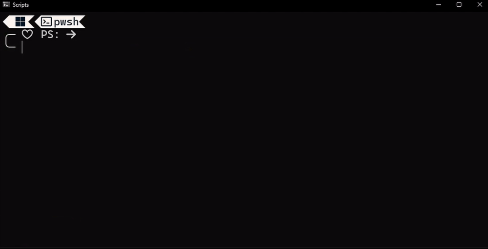
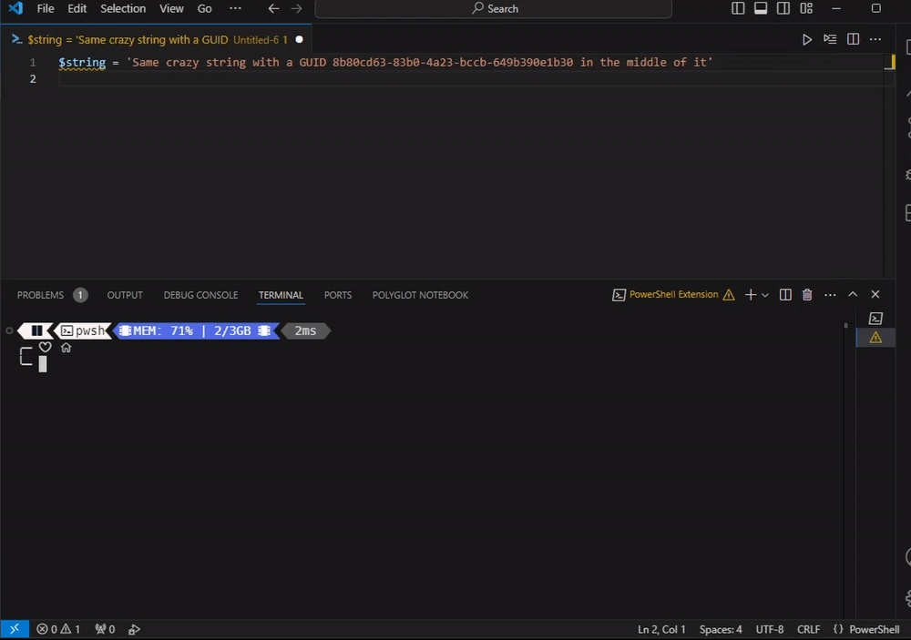
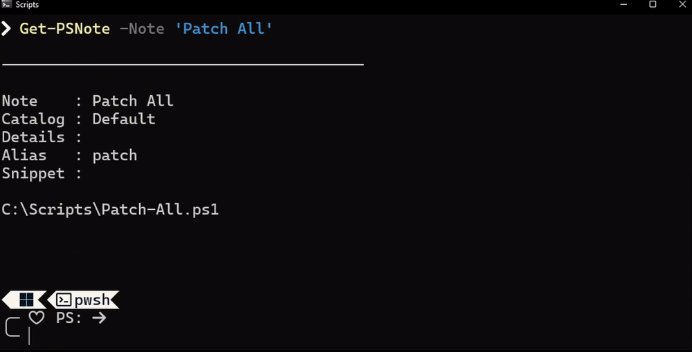
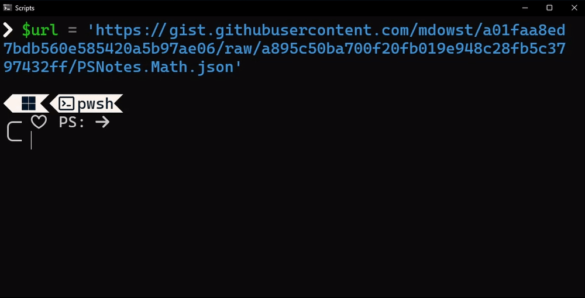

# PSNotes

PSNotes is a PowerShell module that lets you:

* Store reusable snippets and scripts
* Assign memorable aliases
* Tag and categorize them
* Execute, copy, or preview instantly
* Organize them into local or remote catalogs
* Browse them from a terminal menu

It’s not just a snippet tool. A structured engine for reusable automation patterns.

PSNotes isn’t about storing code.
It’s about lowering cognitive load.

The best automation engineers don’t memorize commands.
They build systems to remember for them.

## Why PSNotes?

If you're an automation engineer, you've done this:

* Saved commands in random text files
* Dug through Slack to find “that fix from last month”
* Scrolled your history hoping it’s still there
* Searched through scripts scattered everywhere
* Rebuilt a command you *know* you already wrote once

PSNotes replaces tribal memory with structured recall.

---
# Quick Links
* [Key Features](#key-features)
* [Installation](#installation)
* [Get Started](#get-started)
* [Roadmap](#roadmap)
* [Architecture](#architecture)
---

# Key Features

### Interactive Console

> Browse, search, and execute from a menu directly in your terminal.



> Works from Windows Terminal, VSCode, pwsh, or any PowerShell host.



---

### Run Snippets Instantly

> When you create a new note, you can define an alias that you can later use to display or run it.


---

### Execute Script Paths

> Notes can either be saved as snippets or point directly to a script file.

```powershell
New-PSNote -Name "Patch All" -Alias patch -ScriptPath 'C:\Scripts\Patch-All.ps1'
```



---

### Catalogs (Local + Remote)

> Catalogs can be imported from remote URLs. Letting you access your notes from everywhere.


```powershell
Import-RemoteCatalog -Url https://...
Get-PSNote -Catalog TeamShared
```




---

# Installation

```powershell
Install-Module PSNotes
```

Or from source:

```powershell
# clone repo
git clone https://github.com/mdowst/PSNotes
cd PSNotes
# build solution
. .\tools\build.ps1
# import module
Import-Module .\bin\PSNotes\<version>\PSNotes.psd1
```

---

# Get Started

## Create Notes

This example creates a new note for the `Get-AzVM` cmdlet. The `-Run` parameter tells `PSNotes` to automatically execute the snippet when called via the alias.

```powershell
New-PSNote -Name "List VMs" -Alias vmlist -Snippet "Get-AzVM" -Run $true
```

---

## Search

Don't worry if you can't remember the alias you assigned to a note. You can use `Get-PSNote` to search your notes by name, tags, and keywords.

```powershell
Get-PSNote -Search azure
Get-PSNote -Tag network
```

---

## Run

Snippets can be run directly from the `Get-PSNote` search. 

```powershell
Get-PSNote -Name vmlist -Run
```

or simply:

```powershell
vmlist
```

---

## Copy to Clipboard

Copying to your clipboard works the same as running.

```powershell
Get-PSNote vmlist -Copy
```

or simply:

```powershell
vmlist -copy
```

---

## Export / Import

Not only does PSNotes allow you to create your own custom notes. It allows you to share them between computers and users. You can create a list of notes export them and share them with your team. Notes are stored in easy to read and edit JSON files in case you want to make manual edits.

```powershell
Export-PSNote -Catalog Personal -Path .\backup.json
Import-PSNoteCatalog -Path .\backup.json
```

You can also import remote catalogs from any accessible URL. These can easily be hosted on GitHub or Gist.\
Remote catalogs will resync with the source URL everytime the module is loaded.\
A local cache is maintained incase the URL is unaccessable.\

Import with `-AsLocal` will create a local copy that you can update and edit. It does not maintain a sync with the remote list.

```powershell
Import-RemoteCatalog -Name 'MyRemote' -Url https://gist.githubusercontent.com/example/stuff.json
Import-RemoteCatalog -Name 'CopyLocal' -Url https://gist.githubusercontent.com/example/stuff.json -AsLocal
```

Note: PSNotes stores your notes in your local AppData folder using the path `%appdata%\PSNotes` or `home\PSNotes`. 

---

## Updating / Migrating

PSNotes catalogs are versioned. As the internal schema evolves, older catalogs may need to be migrated to the latest format.

If PSNotes detects older catalogs it will direct you to run the `Update-PSNoteStore` command ensures your catalogs stay compatible without manual intervention.

```powershell
Update-PSNoteStore
```

If a migrated note conflicts with an existing one, the import process will prompt for what actions you want to take. (Overwrite, skip, rename)

Yes. Migration operates on catalog files and re-imports them through the same structured store logic used by the module. Your notes are preserved and updated to the current schema.

---

# Roadmap

Planned enhancements:

* Git-backed catalogs
* Signed remote catalogs
* Cloud sync
* Enhanced TUI navigation
* Keyboard shortcuts
* VSCode Extension
* PSReadLine backup and searching

---

# Architecture

PSNotes is designed as a structured automation memory system, not just a flat snippet file.

At its core, PSNotes is built around a versioned note store, catalog separation, and a consistent execution pipeline.

## Core Components

### Note Store

The **Note Store** is the central persistence layer.

* Backed by JSON
* Versioned using `StoreVersion`
* Automatically migrated when formats evolve
* Managed through structured commands (not direct file edits)

All catalogs live inside the PSNotes home directory and are loaded through the store layer.

This allows:

* Safe schema evolution
* Predictable imports/exports
* Conflict handling
* Future metadata expansion

### Catalogs

A catalog is a logical collection of notes.

Catalogs provide:

* Isolation (Personal, Team, Lab, etc.)
* Portability (export/import as JSON)
* Remote distribution
* Structured organization at scale

Catalogs are first-class citizens, not just tags.

### Notes

Each note is a structured object containing:

* `Note` (name)
* `Alias`
* `Snippet` (or script path)
* `Tags`
* `Details`
* `Run`
* `Kind`
* `StoreVersion`

Notes are not raw text. They are typed automation artifacts.

This enables:

* Parameterized execution
* Splatting patterns
* Future structured search
* Metadata-driven filtering
* Execution control

### Execution Model

PSNotes turns notes into executable commands.

When invoked:

* The store resolves the note
* Execution behavior is determined by `Kind`
  * Snippet
  * Script path
* The `Run` property controls preview vs execution
* Aliases behave like native commands

This makes notes feel like real PowerShell functions without writing modules.

### Remote Catalog Layer

Remote catalogs allow structured sharing.

You can:

* Register remote catalogs
* Cache them locally
* Convert them to local catalogs
* Remove registrations cleanly

Because catalogs are versioned and schema-driven, remote catalogs can evolve safely.

## Versioning & Migration

The store format is versioned.

When the schema changes:

* `Update-PSNoteStore` scans for outdated catalogs
* Migrates them to the current format
* Re-imports them using structured conflict rules

This allows PSNotes to grow without breaking your operational memory.

## Search & Filtering Engine

PSNotes supports structured retrieval via:

* Alias lookup
* Tag filtering
* Catalog filtering
* Text search

Because notes are stored as structured objects, future enhancements can include:

* Full-text snippet search
* Regex-based search
* Cross-catalog queries
* Metadata indexing
* Fuzzy matching

The architecture supports this evolution.

## Design Principles

PSNotes was built around a few core ideas:
* First and foremost **Portable over siloed**
* Structured over ad-hoc
* Versioned over fragile
* Composable over static
* Searchable over memorized

---

# License

[MIT](LICENSE)

